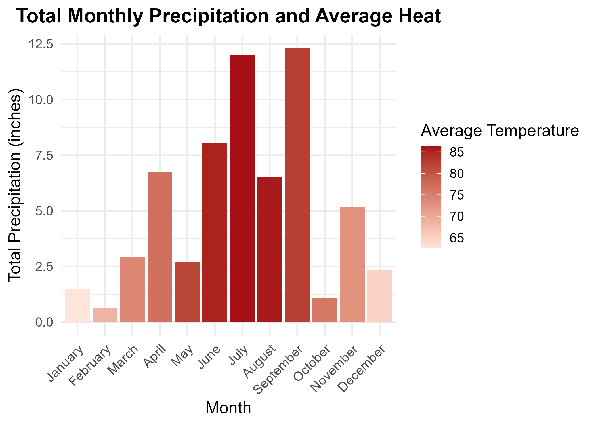

# Data Visualization and Reproducible Research

> Brandon Harkhu. 

The following is a sample of products created during the _"Data Visualization and Reproducible Research"_ course.

## Project 01

In the `project_01/` folder you can find an analysis of the rodent distribution in New York City. The work assesses the amount of rats per borough, 
complaints per year, and spatial distribution throughout the city. The work provides insights into which boroughs are the most afflicted, how the amount
of complaints changed over time, and where in the city they are located. From the data it can be seen that the Bronx initially had the most rat complaints
but then drastically decreased to be at a similar level to other boroughs. Overall, looking at the three years assessed, Brooklyn is the **least honorable**
as it had the most overall rodent complaints. The figure below illustrates the change in rodent complaints over time.

**Visualization 1:** 

## Project 02

In this project, I explored mathematical, spatial and interactive visualizations using R. Using shapefiles the arrangement of lakes in Florida State
were visualized; additionally, the performance of the NBA Lakers and a 2017 Marathons were assessed. From this analysis, it can be observed that there is a 
higher distribution of lakes in the central region of Florida of similar areas. Considering the NBA championship performance of the Lakers, it can be seen that 
in their initial appearances, they tended to score higher points in earlier games and taper off to 100 pts per game. Towards the later appearances the team appears
to maintain the the 100 pts per game rate for all games. Find the code and report in the `project_02/` folder. The figure below illustrates the distribution of lakes 
in the State of Florida.

**Visualization 2:**  

## Project 03

In this project, I explored the temperature and precipitation variation at Tampa International Airport (TPA) during the year 2022. The analysis investigated 
the occurrences of the maximum temperatures for each month and the temperature distribution per month. By visual inspection it can be seen that the airport experiences
a temperature range of 70 degrees in December and 90 degrees in July. The figure below illustrates the total precipitation and average temperature per month.

**Visualization 3:** 

### Moving Forward

In this class I learned the fundamentals of R programming, working in R-Studio, using the Tidyverse package to create data visualizations with mapped aesthetics.
Additionally, I learned about git version control and Markdown syntax. I plan to continue exploring the plotting functionality of R for data visualization in my
own research for data storytelling. My work involves the analysis of various configurations of spring geometries with different mechanical properties, by using R 
I can potentially filter and sort through the experimental data to create compelling and cohesive visualizations that convey the effect of each configuration.

