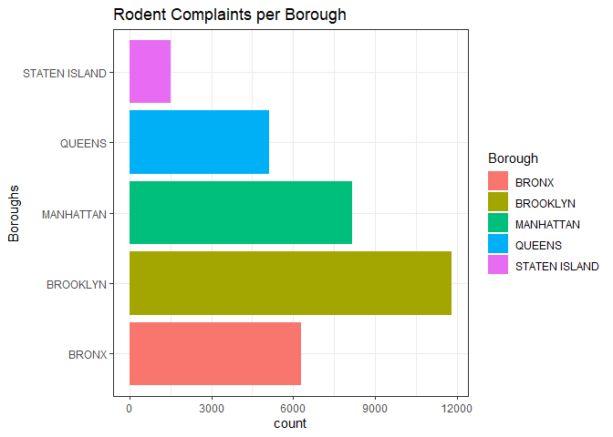
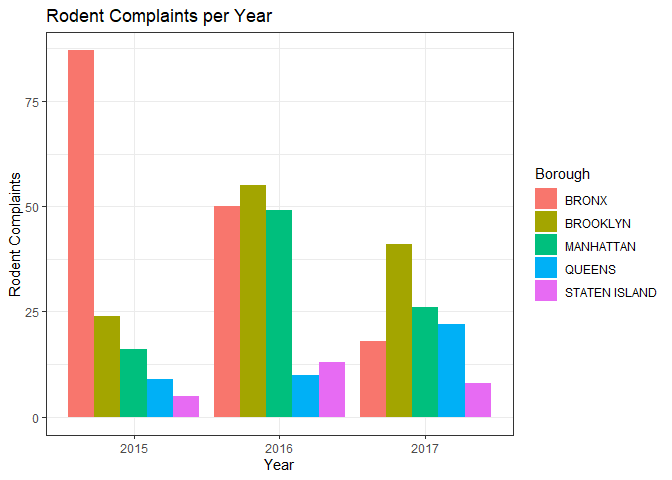
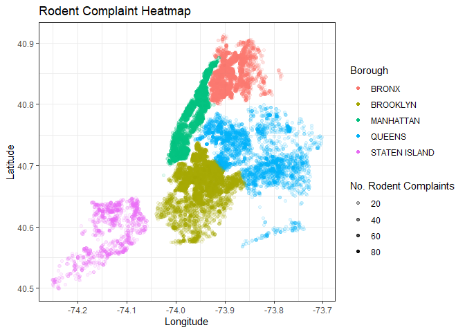
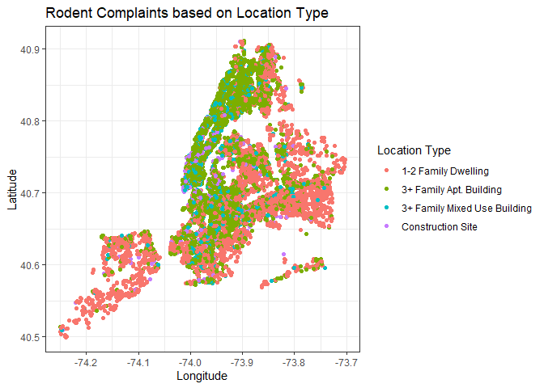

# Data Visualization Project 01

_revised version of mini-project 01 goes here_
# Objectives
The goal of this project is to develop three data visualizations from a data set to demonstrate the skills learned so far. This work analyzes rodent sightings/complaint data from New York City. The large data set is imported and cleaned to include relevant variables and observations. Here, the data is imported from the rats_nyc.csv file which includes numerous parameters about each observation including street/cross-stress names, locations, building classifications, etc. It is filtered to include relevant data regarding the complaint type, sighting year, borough, location coordinates and location type. 

### (a) What were the original charts you planned to create for this assignment?
Upon inspection of the rows and columns of the rats_nyc.csv file, the initial intent was to create data visualizations that utilized bars and points. I additionally wanted to illustrate distributions and trends throughout space (each borough) and time. 

### (b) What story could you tell with your plots?
The plots created for this project illustrate the distribution of rodent complaints throughout the five boroughs. The first plot illustrates the distribution of the sum rodent complaints throughout the five boroughs, indicating which borough has the largest rodent problem. The second plot illustrates the rodent complaints over time to depict the change in rodent reports in each borough throughout the three years included in the study. The third plot illustrates the distribution of rodent complaints in the five boroughs spatially, and plots the incident locations on a map. The transparency of the points is coupled to the amount of complaints thereby depicting a heatmap of the areas with the most rodent complaints. The fourth plot removes the transparency and depicts each incident location by borough and creates a visualization of the affected NYC areas. The fifth plot applies the color to the location type of the incident and assesses the distribution of rodent complaints in residential homes.

### (c) How did you apply the principles of data visualizations and design for this assignment?
The principles of data visualization were applied to each plot to ensure the audience can interpret the data. Some actions that were taken to realize this were the use of aesthetics; by linking attributes like color to the boroughs, it allows for a clearer view of the data by creating separations. Additionally, titles, axis labels, themes and legends were implemented to reduce the complexity of the data and provide a sense of navigation.

## Data Visual 1

``` r
library(tidyverse)

link <- "data/rats_nyc.csv"
ratData <- read_csv(link)
clean <- ratData %>%
  count(complaint_type,sighting_year,borough,longitude,latitude,location_type)
```

The first plot illustrates the distribution of rodent complaints by borough, over the course of the 3 years evaluated in the data set. It can be observed that Brooklyn has the highest rodent complaint count, followed by Manhattan, the Bronx, Queens, and Staten Island. 

``` r
p <- ggplot(data = clean, mapping = aes(x = borough,fill = borough)) + 
  labs(x = "Boroughs", title = "Rodent Complaints per Borough", fill = "Borough")
p + geom_bar() + theme_bw() + coord_flip()
```

<!-- -->
## Data Visual 2
The second plot illustrates the distribution of complaints per borough evaluated at each year. It can be seen that at the beginning of the study in 2015 the Bronx had the highest amount of complaints but was reduced in the following years. Additionally, it can be observed that the number of incidents for the Bronx dropped to values closer to other boroughs, leaving Brooklyn with the most rodent complaints

``` r
q <- ggplot(data = clean, mapping = aes(x = factor(sighting_year), y =n, fill = borough)) + 
  labs(x = "Year",y = "Rodent Complaints", title = "Rodent Complaints per Year", fill = "Borough")
q  + geom_bar(stat = "identity", position = "dodge") + theme_bw()
```

<!-- -->
## Data Visual 3
Another way to visualize the distribution of rodent complaints by borough and number of complaints is to use the associated location data to plot the incident on a map. By associating color with borough the location distribution can be assessed. By coupling the transparency of the data point with the amount of rodent complaints, the density of complaints can be assessed by location, seeing where the majority of complaints occur visually on a map. It can be observed that the density of complaints is largest in areas away from the water. Additionally, a big gap can be noted in Manhattan, highlighting where Central Park is located.

``` r
r <- ggplot(data = clean, mapping = aes(x = longitude,y=latitude,color = borough,alpha = n)) + 
  labs(x = "Longitude", y = "Latitude", title = "Rodent Complaint Heatmap", color = "Borough", alpha = "No. Rodent Complaints")
r + geom_point() + theme_bw()
```

```
## Warning: Removed 84 rows containing missing values or values outside the scale range
## (`geom_point()`).
```

<!-- -->

## Data Visual 4
By removing the transparency aesthetic, a map of New York City can be generated by plotting the locations of each incident and associating each data point with the color related to the incident borough.

``` r
s <- ggplot(data = clean, mapping = aes(x = longitude,y=latitude,color = borough)) + 
  labs(x = "Longitude", y = "Latitude", title = "Map of NYC based on Rodent Complaint Distribution", color = "Borough", alpha = "No. Rodent Complaints")
s + geom_point() + theme_bw()
```

```
## Warning: Removed 84 rows containing missing values or values outside the scale range
## (`geom_point()`).
```

<!-- -->

## Data Visual 5
To evaluate the impact of rodents in residential areas, the data set is filtered to location types based on family dwellings and new construction zones.

``` r
filtered_df <- ratData %>% filter(location_type %in% c("1-2 Family Dwelling", "3+ Family Apt. Building","3+ Family Mixed Use Building","Construction Site"))
t <- ggplot(data = filtered_df, mapping = aes(x = longitude, y = latitude, color = location_type)) + 
  labs(x = "Longitude",y = "Latitude", title = "Rodent Complaints based on Location Type", color = "Location Type")
t + geom_point() + theme_bw()
```

```
## Warning: Removed 90 rows containing missing values or values outside the scale range
## (`geom_point()`).
```

<!-- -->
