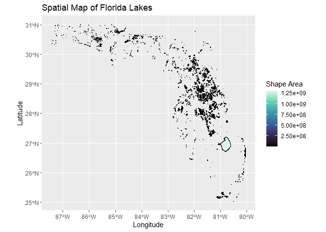
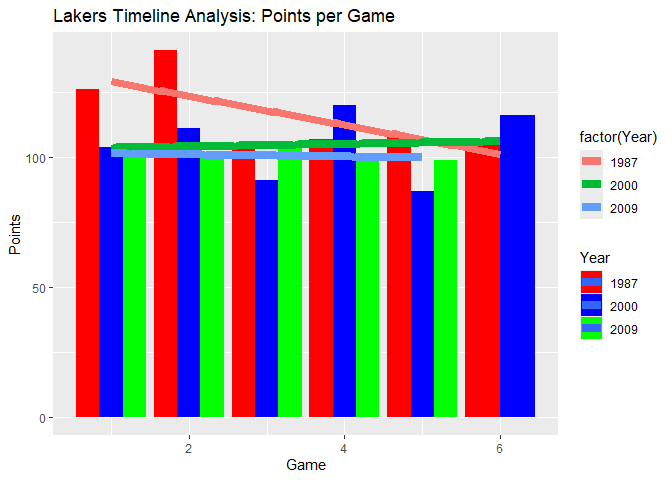

# Data Visualization Project 02

_revised version of mini-project 02 goes here_
# Objectives
The goal of this project is to develop three data visualizations from a distinct data sets to demonstrate skill in R by developing interactive plots, using various data types, and modeling the data. This work analyzes data collected from a 2017 Marathon, NBA Championship Data, and geological data surveying Florida's Lakes to create these plots.

### (a) What were the original charts you planned to create for this assignment?
I planned to use the spatial data to plot a map recreating the shape of Florida from the lakes. When assessing the data for the marathon runners and NBA champions I wanted to create plots that utilized point and bar geometries and implemented color to aid in the interpretation. The two sport relate data set's seemed promising to evaluate and generate a model; the NBA champions set was populated with more data per team so I chose to model the data for certain years.

### (b) What story could you tell with your plots?
The plots created for this project illustrate three distinct stories. The first illustrates the distribution of lake area in Florida State; the story it conveys is the relationship between the density of lakes near each other in regards to its overall area and shows a concentration of lakes in the center of the state. The second depicts the points per game for the Lakers over the course of their occurrences in the NBA Championships. The story it tells is that earlier iterations of the Lakers team scored higher points in initial games and attenuated to a stead value; in the following years the amount of points gained during the initial games decreased but peaks during the 4th and 6th games. The final plot illustrates the relationship between 5K lap time and age. It shows a story of determination and perseverance as the runners with the shortest 5K time and best pace included the young and the old.

### (c) How did you apply the principles of data visualizations and design for this assignment?
The principles of data visualization were applied to each plot to ensure the audience can interpret the data. Some actions that were taken to realize this were the use of aesthetics; by linking attributes like color to the NBA team years it allows for a clearer view of timeline for this team and how their performance changed. Additionally, titles, axis labels, themes and legends were implemented to reduce the complexity of the data and provide a sense of navigation for the audience. This ensure the audience can interpret the trends shown and follow along with headings.

# Including Libraries and Reading Data

``` r
library(tidyverse)
```

```
## ── Attaching core tidyverse packages ──────────────────────── tidyverse 2.0.0 ──
## ✔ dplyr     1.1.4     ✔ readr     2.1.5
## ✔ forcats   1.0.0     ✔ stringr   1.5.1
## ✔ ggplot2   3.5.2     ✔ tibble    3.2.1
## ✔ lubridate 1.9.4     ✔ tidyr     1.3.1
## ✔ purrr     1.0.4     
## ── Conflicts ────────────────────────────────────────── tidyverse_conflicts() ──
## ✖ dplyr::filter() masks stats::filter()
## ✖ dplyr::lag()    masks stats::lag()
## ℹ Use the conflicted package (<http://conflicted.r-lib.org/>) to force all conflicts to become errors
```

``` r
library(sf)
```

```
## Linking to GEOS 3.13.1, GDAL 3.11.0, PROJ 9.6.0; sf_use_s2() is TRUE
```

``` r
library(plotly)
```

```
## 
## Attaching package: 'plotly'
## 
## The following object is masked from 'package:ggplot2':
## 
##     last_plot
## 
## The following object is masked from 'package:stats':
## 
##     filter
## 
## The following object is masked from 'package:graphics':
## 
##     layout
```

``` r
runData <- read_csv("data/marathon_results_2017.csv")
```

```
## Warning: One or more parsing issues, call `problems()` on your data frame for details,
## e.g.:
##   dat <- vroom(...)
##   problems(dat)
```

```
## Rows: 26410 Columns: 22
## ── Column specification ────────────────────────────────────────────────────────
## Delimiter: ","
## chr  (10): Bib, Name, M/F, City, State, Country, 10K, 15K, 20K, Proj Time
## dbl   (4): Age, Overall, Gender, Division
## time  (8): 5K, Half, 25K, 30K, 35K, 40K, Pace, Official Time
## 
## ℹ Use `spec()` to retrieve the full column specification for this data.
## ℹ Specify the column types or set `show_col_types = FALSE` to quiet this message.
```

``` r
ballData <- read_csv("data/NBAchampionsdata.csv")
```

```
## Rows: 220 Columns: 24
## ── Column specification ────────────────────────────────────────────────────────
## Delimiter: ","
## chr  (1): Team
## dbl (23): Year, Game, Win, Home, MP, FG, FGA, FGP, TP, TPA, TPP, FT, FTA, FT...
## 
## ℹ Use `spec()` to retrieve the full column specification for this data.
## ℹ Specify the column types or set `show_col_types = FALSE` to quiet this message.
```

``` r
lakeData <- read_sf("data/Florida_Lakes/Florida_Lakes.shp")
```

# Spatial Visualization
This plot illustrates the distribution of lakes in Florida State. Using the .shp file, the lake data is mapped to the longitude (x-axis) and latitude (y-axis) to create the shapes. Next, the color of the lakes are mapped to a blue color scheme and the area of each lake is mapped to the color aesthetic to illustrate the size of the lake and its surrounding lakes. It can be observed that the highest density of lakes occurs in the Central Florida region with a uniform distribution of area; additionally, the largest lake can be spotted at 81 deg West and 28 deg North.

``` r
p <- ggplot() +
  geom_sf(data = lakeData, mapping = aes(fill = SHAPEAREA), color = "black", size = 0.2) +
  scale_fill_viridis_c(option = "mako", na.value = "grey80")
p + labs(title = "Spatial Map of Florida Lakes",fill = "Shape Area", x = "Longitude", y = "Latitude")
```

<!-- -->

``` r
ggsave("figures/PROJECT2_FIG1.png")
```

```
## Saving 7 x 5 in image
```

# Model Visualization
This plot surveys the Lakers and illustrates the points scored per game of their appearances in the NBA championships. Three years are included in the dataset for the Laker's and assessed in a bar chart to assess the point distribution. It can be observed that over time there is a noticable decline in point obtained in the first two games but the trendline shows that overall the team obtains near 100 pts per game. 

``` r
teamS = c("Lakers")
yearS = c("1987", "2000", "2009")
col = c("red", "blue", "green")
nba_data <- ballData %>%
  filter(Team %in% teamS , Year %in% yearS)

q <- ggplot(data = nba_data, mapping = aes(x = Game, y = PTS, fill = factor(Year)))
q + geom_col(position = "dodge") + scale_fill_manual(values = col) +
  labs(title = "Lakers Timeline Analysis: Points per Game", x = "Game", y = "Points", fill = "Year") +
  geom_smooth(method = "lm", aes(group = Year, color = factor(Year)), se = FALSE, size = 3)
```

```
## Warning: Using `size` aesthetic for lines was deprecated in ggplot2 3.4.0.
## ℹ Please use `linewidth` instead.
## This warning is displayed once every 8 hours.
## Call `lifecycle::last_lifecycle_warnings()` to see where this warning was
## generated.
```

```
## `geom_smooth()` using formula = 'y ~ x'
```

<!-- -->

``` r
ggsave("figures/PROJECT2_FIG2.png")
```

```
## Saving 7 x 5 in image
## `geom_smooth()` using formula = 'y ~ x'
```

# Interactive Visualization
The final plot illustrates the relationship between 5K marathon times and contestant age. It can be shown that despite age differences, runners with the fastest times can be in the range of 25-40 years old. The scaled pace is calculated by taking the ratio of the runners pace with that of the slowest pace; the lower the percentage, the faster the runner was throughout the duration of the race. It can be shown that although for the first 5K the young and older runners can achiever similar lap times, as the distance progresses to the 10K, 20K mark, the lap time increases along with the scaled pace.

``` r
library(plotly)
cleanRun <- runData %>%
  filter(Country == "USA") %>%
  rename(`Points5K` = `5K`) %>%
  arrange(Points5K)  %>%
  mutate(scaledPace = (as.numeric(Pace) / max(as.numeric(Pace))) * 100, na.rm = TRUE)%>%
  slice_head(n=40)


my_plot <- ggplot( data = cleanRun) +
  geom_point(aes(x = Age, y = Points5K, colour  = State, size = scaledPace )) +
  theme_minimal() +
  labs(title = "5K Time vs. Age", x = "Age", y = "5K Lap Time", colour = "State", size = "Pace")

ggplotly(my_plot)
```

```{=html}
<div class="plotly html-widget html-fill-item" id="htmlwidget-7ec1cb3873705edf069c" style="width:672px;height:480px;"></div>
<script type="application/json" data-for="htmlwidget-7ec1cb3873705edf069c">{"x":{"data":[{"x":[40,28,32],"y":[925,925,983],"text":["Age: 40<br />Points5K: 00:15:25<br />State: AZ<br />scaledPace: 27.76256","Age: 28<br />Points5K: 00:15:25<br />State: AZ<br />scaledPace: 35.98174","Age: 32<br />Points5K: 00:16:23<br />State: AZ<br />scaledPace: 28.94977"],"type":"scatter","mode":"markers","marker":{"autocolorscale":false,"color":"rgba(248,118,109,1)","opacity":1,"size":[7.5218174852661894,18.748687263899331,10.438981289712437],"symbol":"circle","line":{"width":1.8897637795275593,"color":"rgba(248,118,109,1)"}},"hoveron":"points","name":"AZ","legendgroup":"AZ","showlegend":true,"xaxis":"x","yaxis":"y","hoverinfo":"text","frame":null},{"x":[41,32,39],"y":[924,925,997],"text":["Age: 41<br />Points5K: 00:15:24<br />State: CA<br />scaledPace: 28.67580","Age: 32<br />Points5K: 00:15:25<br />State: CA<br />scaledPace: 27.67123","Age: 39<br />Points5K: 00:16:37<br />State: CA<br />scaledPace: 30.22831"],"type":"scatter","mode":"markers","marker":{"autocolorscale":false,"color":"rgba(231,133,30,1)","opacity":1,"size":[9.8906614182383166,7.1957552412386887,12.555975382919517],"symbol":"circle","line":{"width":1.8897637795275593,"color":"rgba(231,133,30,1)"}},"hoveron":"points","name":"CA","legendgroup":"CA","showlegend":true,"xaxis":"x","yaxis":"y","hoverinfo":"text","frame":null},{"x":[33,44,41],"y":[925,993,998],"text":["Age: 33<br />Points5K: 00:15:25<br />State: CO<br />scaledPace: 27.85388","Age: 44<br />Points5K: 00:16:33<br />State: CO<br />scaledPace: 34.06393","Age: 41<br />Points5K: 00:16:38<br />State: CO<br />scaledPace: 31.50685"],"type":"scatter","mode":"markers","marker":{"autocolorscale":false,"color":"rgba(208,148,0,1)","opacity":1,"size":[7.8216626640614102,17.010520479004818,14.253483297899081],"symbol":"circle","line":{"width":1.8897637795275593,"color":"rgba(208,148,0,1)"}},"hoveron":"points","name":"CO","legendgroup":"CO","showlegend":true,"xaxis":"x","yaxis":"y","hoverinfo":"text","frame":null},{"x":[28],"y":[961],"text":"Age: 28<br />Points5K: 00:16:01<br />State: CT<br />scaledPace: 31.59817","type":"scatter","mode":"markers","marker":{"autocolorscale":false,"color":"rgba(178,161,0,1)","opacity":1,"size":14.364321895014882,"symbol":"circle","line":{"width":1.8897637795275593,"color":"rgba(178,161,0,1)"}},"hoveron":"points","name":"CT","legendgroup":"CT","showlegend":true,"xaxis":"x","yaxis":"y","hoverinfo":"text","frame":null},{"x":[37],"y":[1001],"text":"Age: 37<br />Points5K: 00:16:41<br />State: FL<br />scaledPace: 35.89041","type":"scatter","mode":"markers","marker":{"autocolorscale":false,"color":"rgba(137,172,0,1)","opacity":1,"size":18.670518793819454,"symbol":"circle","line":{"width":1.8897637795275593,"color":"rgba(137,172,0,1)"}},"hoveron":"points","name":"FL","legendgroup":"FL","showlegend":true,"xaxis":"x","yaxis":"y","hoverinfo":"text","frame":null},{"x":[32,25,29,24,31,28,29,30],"y":[925,950,970,970,988,997,997,998],"text":["Age: 32<br />Points5K: 00:15:25<br />State: MA<br />scaledPace: 28.40183","Age: 25<br />Points5K: 00:15:50<br />State: MA<br />scaledPace: 33.05936","Age: 29<br />Points5K: 00:16:10<br />State: MA<br />scaledPace: 29.40639","Age: 24<br />Points5K: 00:16:10<br />State: MA<br />scaledPace: 31.05023","Age: 31<br />Points5K: 00:16:28<br />State: MA<br />scaledPace: 29.95434","Age: 28<br />Points5K: 00:16:37<br />State: MA<br />scaledPace: 30.04566","Age: 29<br />Points5K: 00:16:37<br />State: MA<br />scaledPace: 30.31963","Age: 30<br />Points5K: 00:16:38<br />State: MA<br />scaledPace: 29.86301"],"type":"scatter","mode":"markers","marker":{"autocolorscale":false,"color":"rgba(69,181,0,1)","opacity":1,"size":[9.2880291791824092,16.0017952774215,11.264107411477223,13.680696037711819,12.147542225575702,12.285865888466143,12.687959448019498,12.006893306595471],"symbol":"circle","line":{"width":1.8897637795275593,"color":"rgba(69,181,0,1)"}},"hoveron":"points","name":"MA","legendgroup":"MA","showlegend":true,"xaxis":"x","yaxis":"y","hoverinfo":"text","frame":null},{"x":[37,36,26],"y":[964,991,998],"text":["Age: 37<br />Points5K: 00:16:04<br />State: MI<br />scaledPace: 30.31963","Age: 36<br />Points5K: 00:16:31<br />State: MI<br />scaledPace: 29.95434","Age: 26<br />Points5K: 00:16:38<br />State: MI<br />scaledPace: 35.06849"],"type":"scatter","mode":"markers","marker":{"autocolorscale":false,"color":"rgba(0,188,81,1)","opacity":1,"size":[12.687959448019498,12.147542225575702,17.94760855529794],"symbol":"circle","line":{"width":1.8897637795275593,"color":"rgba(0,188,81,1)"}},"hoveron":"points","name":"MI","legendgroup":"MI","showlegend":true,"xaxis":"x","yaxis":"y","hoverinfo":"text","frame":null},{"x":[40],"y":[998],"text":"Age: 40<br />Points5K: 00:16:38<br />State: MN<br />scaledPace: 30.59361","type":"scatter","mode":"markers","marker":{"autocolorscale":false,"color":"rgba(0,192,135,1)","opacity":1,"size":13.072671573124191,"symbol":"circle","line":{"width":1.8897637795275593,"color":"rgba(0,192,135,1)"}},"hoveron":"points","name":"MN","legendgroup":"MN","showlegend":true,"xaxis":"x","yaxis":"y","hoverinfo":"text","frame":null},{"x":[26,31],"y":[991,1009],"text":["Age: 26<br />Points5K: 00:16:31<br />State: MO<br />scaledPace: 32.96804","Age: 31<br />Points5K: 00:16:49<br />State: MO<br />scaledPace: 35.79909"],"type":"scatter","mode":"markers","marker":{"autocolorscale":false,"color":"rgba(0,192,178,1)","opacity":1,"size":[15.905932874073981,18.591937816623755],"symbol":"circle","line":{"width":1.8897637795275593,"color":"rgba(0,192,178,1)"}},"hoveron":"points","name":"MO","legendgroup":"MO","showlegend":true,"xaxis":"x","yaxis":"y","hoverinfo":"text","frame":null},{"x":[29],"y":[940],"text":"Age: 29<br />Points5K: 00:15:40<br />State: NC<br />scaledPace: 29.31507","type":"scatter","mode":"markers","marker":{"autocolorscale":false,"color":"rgba(0,188,214,1)","opacity":1,"size":11.106519660318744,"symbol":"circle","line":{"width":1.8897637795275593,"color":"rgba(0,188,214,1)"}},"hoveron":"points","name":"NC","legendgroup":"NC","showlegend":true,"xaxis":"x","yaxis":"y","hoverinfo":"text","frame":null},{"x":[41,28,23,27],"y":[924,958,980,995],"text":["Age: 41<br />Points5K: 00:15:24<br />State: NY<br />scaledPace: 29.04110","Age: 28<br />Points5K: 00:15:58<br />State: NY<br />scaledPace: 31.50685","Age: 23<br />Points5K: 00:16:20<br />State: NY<br />scaledPace: 31.96347","Age: 27<br />Points5K: 00:16:35<br />State: NY<br />scaledPace: 41.18721"],"type":"scatter","mode":"markers","marker":{"autocolorscale":false,"color":"rgba(0,179,242,1)","opacity":1,"size":[10.611982923422246,14.253483297899081,14.796530799309684,22.677165354330711],"symbol":"circle","line":{"width":1.8897637795275593,"color":"rgba(0,179,242,1)"}},"hoveron":"points","name":"NY","legendgroup":"NY","showlegend":true,"xaxis":"x","yaxis":"y","hoverinfo":"text","frame":null},{"x":[30,27],"y":[924,924],"text":["Age: 30<br />Points5K: 00:15:24<br />State: OR<br />scaledPace: 27.21461","Age: 27<br />Points5K: 00:15:24<br />State: OR<br />scaledPace: 28.21918"],"type":"scatter","mode":"markers","marker":{"autocolorscale":false,"color":"rgba(40,163,255,1)","opacity":1,"size":[3.7795275590551185,8.8466120726919399],"symbol":"circle","line":{"width":1.8897637795275593,"color":"rgba(40,163,255,1)"}},"hoveron":"points","name":"OR","legendgroup":"OR","showlegend":true,"xaxis":"x","yaxis":"y","hoverinfo":"text","frame":null},{"x":[30,29],"y":[998,1005],"text":["Age: 30<br />Points5K: 00:16:38<br />State: PA<br />scaledPace: 35.43379","Age: 29<br />Points5K: 00:16:45<br />State: PA<br />scaledPace: 35.52511"],"type":"scatter","mode":"markers","marker":{"autocolorscale":false,"color":"rgba(156,141,255,1)","opacity":1,"size":[18.273354119950312,18.353652942508297],"symbol":"circle","line":{"width":1.8897637795275593,"color":"rgba(156,141,255,1)"}},"hoveron":"points","name":"PA","legendgroup":"PA","showlegend":true,"xaxis":"x","yaxis":"y","hoverinfo":"text","frame":null},{"x":[28],"y":[980],"text":"Age: 28<br />Points5K: 00:16:20<br />State: TN<br />scaledPace: 30.13699","type":"scatter","mode":"markers","marker":{"autocolorscale":false,"color":"rgba(210,119,255,1)","opacity":1,"size":12.421975944189427,"symbol":"circle","line":{"width":1.8897637795275593,"color":"rgba(210,119,255,1)"}},"hoveron":"points","name":"TN","legendgroup":"TN","showlegend":true,"xaxis":"x","yaxis":"y","hoverinfo":"text","frame":null},{"x":[28,32,45],"y":[925,950,999],"text":["Age: 28<br />Points5K: 00:15:25<br />State: UT<br />scaledPace: 28.40183","Age: 32<br />Points5K: 00:15:50<br />State: UT<br />scaledPace: 30.77626","Age: 45<br />Points5K: 00:16:39<br />State: UT<br />scaledPace: 32.96804"],"type":"scatter","mode":"markers","marker":{"autocolorscale":false,"color":"rgba(241,102,232,1)","opacity":1,"size":[9.2880291791824092,13.320532238691047,15.905932874073981],"symbol":"circle","line":{"width":1.8897637795275593,"color":"rgba(241,102,232,1)"}},"hoveron":"points","name":"UT","legendgroup":"UT","showlegend":true,"xaxis":"x","yaxis":"y","hoverinfo":"text","frame":null},{"x":[43],"y":[997],"text":"Age: 43<br />Points5K: 00:16:37<br />State: VA<br />scaledPace: 30.86758","type":"scatter","mode":"markers","marker":{"autocolorscale":false,"color":"rgba(255,97,199,1)","opacity":1,"size":13.442078599651914,"symbol":"circle","line":{"width":1.8897637795275593,"color":"rgba(255,97,199,1)"}},"hoveron":"points","name":"VA","legendgroup":"VA","showlegend":true,"xaxis":"x","yaxis":"y","hoverinfo":"text","frame":null},{"x":[45],"y":[1000],"text":"Age: 45<br />Points5K: 00:16:40<br />State: WA<br />scaledPace: 33.05936","type":"scatter","mode":"markers","marker":{"autocolorscale":false,"color":"rgba(255,104,158,1)","opacity":1,"size":16.0017952774215,"symbol":"circle","line":{"width":1.8897637795275593,"color":"rgba(255,104,158,1)"}},"hoveron":"points","name":"WA","legendgroup":"WA","showlegend":true,"xaxis":"x","yaxis":"y","hoverinfo":"text","frame":null}],"layout":{"margin":{"t":43.762557077625573,"r":7.3059360730593621,"b":40.182648401826491,"l":72.32876712328769},"font":{"color":"rgba(0,0,0,1)","family":"","size":14.611872146118724},"title":{"text":"5K Time vs. Age","font":{"color":"rgba(0,0,0,1)","family":"","size":17.534246575342465},"x":0,"xref":"paper"},"xaxis":{"domain":[0,1],"automargin":true,"type":"linear","autorange":false,"range":[21.899999999999999,46.100000000000001],"tickmode":"array","ticktext":["25","30","35","40","45"],"tickvals":[25,30,35,40,45],"categoryorder":"array","categoryarray":["25","30","35","40","45"],"nticks":null,"ticks":"","tickcolor":null,"ticklen":3.6529680365296811,"tickwidth":0,"showticklabels":true,"tickfont":{"color":"rgba(77,77,77,1)","family":"","size":11.68949771689498},"tickangle":-0,"showline":false,"linecolor":null,"linewidth":0,"showgrid":true,"gridcolor":"rgba(235,235,235,1)","gridwidth":0.66417600664176002,"zeroline":false,"anchor":"y","title":{"text":"Age","font":{"color":"rgba(0,0,0,1)","family":"","size":14.611872146118724}},"hoverformat":".2f"},"yaxis":{"domain":[0,1],"automargin":true,"type":"linear","autorange":false,"range":[919.75,1013.25],"tickmode":"array","ticktext":["00:15:20","00:15:40","00:16:00","00:16:20","00:16:40"],"tickvals":[920,940,960,980,1000],"categoryorder":"array","categoryarray":["00:15:20","00:15:40","00:16:00","00:16:20","00:16:40"],"nticks":null,"ticks":"","tickcolor":null,"ticklen":3.6529680365296811,"tickwidth":0,"showticklabels":true,"tickfont":{"color":"rgba(77,77,77,1)","family":"","size":11.68949771689498},"tickangle":-0,"showline":false,"linecolor":null,"linewidth":0,"showgrid":true,"gridcolor":"rgba(235,235,235,1)","gridwidth":0.66417600664176002,"zeroline":false,"anchor":"x","title":{"text":"5K Lap Time","font":{"color":"rgba(0,0,0,1)","family":"","size":14.611872146118724}},"hoverformat":".2f"},"shapes":[{"type":"rect","fillcolor":null,"line":{"color":null,"width":0,"linetype":[]},"yref":"paper","xref":"paper","x0":0,"x1":1,"y0":0,"y1":1}],"showlegend":true,"legend":{"bgcolor":null,"bordercolor":null,"borderwidth":0,"font":{"color":"rgba(0,0,0,1)","family":"","size":11.68949771689498},"title":{"text":"Pace<br />State","font":{"color":"rgba(0,0,0,1)","family":"","size":14.611872146118724}}},"hovermode":"closest","barmode":"relative"},"config":{"doubleClick":"reset","modeBarButtonsToAdd":["hoverclosest","hovercompare"],"showSendToCloud":false},"source":"A","attrs":{"13d445c67e56":{"x":{},"y":{},"colour":{},"size":{},"type":"scatter"}},"cur_data":"13d445c67e56","visdat":{"13d445c67e56":["function (y) ","x"]},"highlight":{"on":"plotly_click","persistent":false,"dynamic":false,"selectize":false,"opacityDim":0.20000000000000001,"selected":{"opacity":1},"debounce":0},"shinyEvents":["plotly_hover","plotly_click","plotly_selected","plotly_relayout","plotly_brushed","plotly_brushing","plotly_clickannotation","plotly_doubleclick","plotly_deselect","plotly_afterplot","plotly_sunburstclick"],"base_url":"https://plot.ly"},"evals":[],"jsHooks":[]}</script>
```

``` r
ggsave("figures/PROJECT2_FIG3.png")
```

```
## Saving 7 x 5 in image
```
