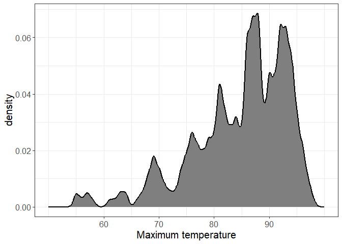
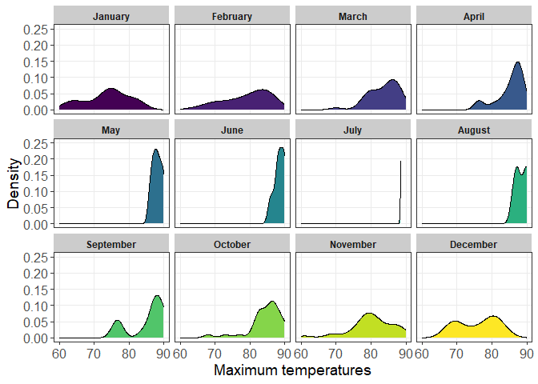

# Data Visualization Project 03


In this exercise you will explore methods to create different types of data visualizations (such as plotting text data, or exploring the distributions of continuous variables).


## PART 1: Density Plots

Using the dataset obtained from FSU's [Florida Climate Center](https://climatecenter.fsu.edu/climate-data-access-tools/downloadable-data), for a station at Tampa International Airport (TPA) for 2022, attempt to recreate the charts shown below which were generated using data from 2016. You can read the 2022 dataset using the code below: 


``` r
library(tidyverse)
weather_tpa <- read_csv("data/tpa_weather_2022.csv")
# random sample 
sample_n(weather_tpa, 4)
```

```
## # A tibble: 4 × 7
##    year month   day precipitation max_temp min_temp ave_temp
##   <dbl> <dbl> <dbl>         <dbl>    <dbl>    <dbl>    <dbl>
## 1  2022    12     6             0       81       66     73.5
## 2  2022     2    18             0       81       68     74.5
## 3  2022    12    28             0       75       48     61.5
## 4  2022     5    12             0       87       66     76.5
```

See Slides from Week 4 of Visualizing Relationships and Models (slide 10) for a reminder on how to use this type of dataset with the `lubridate` package for dates and times (example included in the slides uses data from 2016).

Using the 2022 data: 

(a) Create a plot like the one below:


Hint: the option `binwidth = 3` was used with the `geom_histogram()` function.

``` r
library(lubridate)

tpa_clean <- weather_tpa %>%
  unite("doy", year, month, day, sep = "-") %>%
  mutate(doy = ymd(doy),
         max_temp = as.double(max_temp),
         min_temp = as.double(min_temp),
         precipitation = as.double(precipitation),
         month = month(doy, label = TRUE, abbr = FALSE)
  )

ggplot(tpa_clean, aes(x = max_temp, fill = month)) +
  geom_histogram(binwidth = 3, color = "white") +
  facet_wrap(~ month, ncol = 3) +
  labs(x = "Max Temperature", y = "Number of Days") +
  theme_minimal() + 
  theme(legend.position = "none",
    strip.background = element_rect(fill = "grey80", color = NA)) +
  scale_x_continuous(limits = c(50, 100), breaks = seq(60, 90, 10))
```

```
## Warning: Removed 2 rows containing non-finite outside the scale range
## (`stat_bin()`).
```

```
## Warning: Removed 24 rows containing missing values or values outside the scale range
## (`geom_bar()`).
```

<!-- -->

(b) Create a plot like the one below:


Hint: check the `kernel` parameter of the `geom_density()` function, and use `bw = 0.5`.

``` r
ggplot(tpa_clean, aes(x = max_temp)) +
  geom_density(fill = "gray50", color = "black", bw = 0.5) +
  labs(x = "Max temperature", y = "density") +
  theme_minimal(base_size = 12) +
  scale_x_continuous(limits = c(50, 100), breaks = seq(60, 90, 10))
```

```
## Warning: Removed 2 rows containing non-finite outside the scale range
## (`stat_density()`).
```

<!-- -->


(c) Create a plot like the one below:


Hint: default options for `geom_density()` were used. 

``` r
# Create the faceted density plot
ggplot(tpa_clean, aes(x = max_temp, fill = month)) +
  geom_density(color = "black") +
  facet_wrap(~ month, ncol = 3) +
  scale_x_continuous(limits = c(60, 90), breaks = seq(60, 90, 10)) +
  labs(x = "Max Temperature (°F)", y = "Density") +
  theme_minimal() +
  theme(
    plot.title = element_text(hjust = 0.5, face = "bold", size = 14),
    strip.text = element_text(face = "bold"),
    panel.grid.minor = element_blank(),
    strip.background = element_rect(fill = "grey80", color = NA)
  )
```

```
## Warning: Removed 116 rows containing non-finite outside the scale range
## (`stat_density()`).
```

<!-- -->

(d) Generate a plot like the chart below:


`geom_density_ridges_gradient()`

Hint: use the`{ggridges}` package, and the `geom_density_ridges()` function paying close attention to the `quantile_lines` and `quantiles` parameters. The plot above uses the `plasma` option (color scale) for the _viridis_ palette.

``` r
library(ggridges)

tpa_clean <- tpa_clean %>%
  mutate(
    month = month(doy, label = TRUE, abbr = FALSE),
    month = factor(month, levels = month.name)
  )

ggplot(tpa_clean, aes(x = max_temp, y = month, fill = stat(x))) +
  geom_density_ridges_gradient(
    scale = 3,
    rel_min_height = 0.01,
    color = "black",         # outlines the ridges in black
    size = 0.3,
    quantile_lines = TRUE,
    quantiles = 2,            # adds the median line
    linewidth = 1
  ) +
  scale_fill_viridis_c(option = "plasma", limits = c(60, 100), name = "Temp (°F)") +
  scale_x_continuous(limits = c(50, 100), breaks = seq(50, 100, 10)) +
  labs(x = "Max Temperature (°F)", y = NULL
  ) +
  theme_minimal(base_size = 12) 
```

```
## Warning in geom_density_ridges_gradient(scale = 3, rel_min_height = 0.01, :
## Ignoring unknown parameters: `size`
```

```
## Warning: `stat(x)` was deprecated in ggplot2 3.4.0.
## ℹ Please use `after_stat(x)` instead.
## This warning is displayed once every 8 hours.
## Call `lifecycle::last_lifecycle_warnings()` to see where this warning was
## generated.
```

```
## Picking joint bandwidth of 1.87
```

<!-- -->


(e) Create a plot of your choice that uses the attribute for precipitation _(values of -99.9 for temperature or -99.99 for precipitation represent missing data)_.


## PART 2 

> **You can choose to work on either Option (A) or Option (B)**. Remove from this template the option you decided not to work on. 


### Option (A): Visualizing Text Data

Review the set of slides (and additional resources linked in it) for visualizing text data: Week 6 PowerPoint slides of Visualizing Text Data. 

Choose any dataset with text data, and create at least one visualization with it. For example, you can create a frequency count of most used bigrams, a sentiment analysis of the text data, a network visualization of terms commonly used together, and/or a visualization of a topic modeling approach to the problem of identifying words/documents associated to different topics in the text data you decide to use. 

Make sure to include a copy of the dataset in the `data/` folder, and reference your sources if different from the ones listed below:

- [Billboard Top 100 Lyrics](https://raw.githubusercontent.com/aalhamadani/dataviz_final_project/main/data/BB_top100_2015.csv)

- [RateMyProfessors comments](https://raw.githubusercontent.com/aalhamadani/dataviz_final_project/main/data/rmp_wit_comments.csv)

- [FL Poly News Articles](https://raw.githubusercontent.com/aalhamadani/dataviz_final_project/main/data/flpoly_news_SP23.csv)


(to get the "raw" data from any of the links listed above, simply click on the `raw` button of the GitHub page and copy the URL to be able to read it in your computer using the `read_csv()` function)


### Option (B): Data on Concrete Strength 

Concrete is the most important material in **civil engineering**. The concrete compressive strength is a highly nonlinear function of _age_ and _ingredients_. The dataset used here is from the [UCI Machine Learning Repository](https://archive.ics.uci.edu/ml/index.php), and it contains 1030 observations with 9 different attributes 9 (8 quantitative input variables, and 1 quantitative output variable). A data dictionary is included below: 


Variable                      |    Notes                
------------------------------|-------------------------------------------
Cement                        | kg in a $m^3$ mixture             
Blast Furnace Slag            | kg in a $m^3$ mixture  
Fly Ash                       | kg in a $m^3$ mixture             
Water                         | kg in a $m^3$ mixture              
Superplasticizer              | kg in a $m^3$ mixture
Coarse Aggregate              | kg in a $m^3$ mixture
Fine Aggregate                | kg in a $m^3$ mixture      
Age                           | in days                                             
Concrete compressive strength | MPa, megapascals


Below we read the `.csv` file using `readr::read_csv()` (the `readr` package is part of the `tidyverse`)


``` r
concrete <- read_csv("data/concrete.csv", col_types = cols())
```


Let us create a new attribute for visualization purposes, `strength_range`: 


``` r
new_concrete <- concrete %>%
  mutate(strength_range = cut(Concrete_compressive_strength, 
                              breaks = quantile(Concrete_compressive_strength, 
                                                probs = seq(0, 1, 0.2))) )
```


1. Explore the distribution of 2 of the continuous variables available in the dataset. Do ranges make sense? Comment on your findings.

2. Use a _temporal_ indicator such as the one available in the variable `Age` (measured in days). Generate a plot similar to the one shown below. Comment on your results.


3. Create a scatterplot similar to the one shown below. Pay special attention to which variables are being mapped to specific aesthetics of the plot. Comment on your results. 


