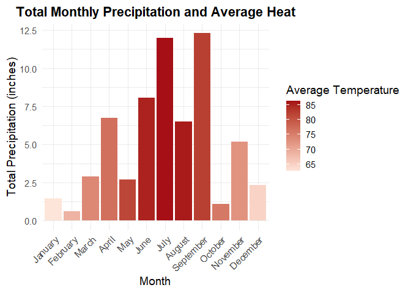
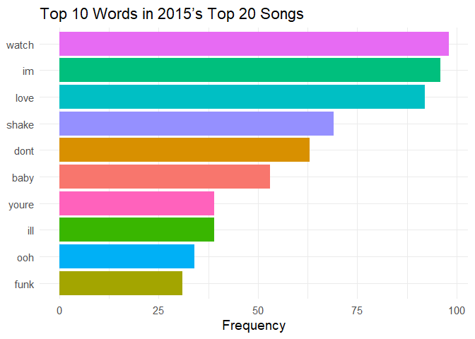

# Data Visualization Project 03


In this exercise you will explore methods to create different types of data visualizations (such as plotting text data, or exploring the distributions of continuous variables).


## PART 1: Density Plots

Using the dataset obtained from FSU's [Florida Climate Center](https://climatecenter.fsu.edu/climate-data-access-tools/downloadable-data), for a station at Tampa International Airport (TPA) for 2022, attempt to recreate the charts shown below which were generated using data from 2016. You can read the 2022 dataset using the code below: 


``` r
library(tidyverse)
weather_tpa <- read_csv("data/tpa_weather_2022.csv")
# random sample 
sample_n(weather_tpa, 4)
```

```
## # A tibble: 4 × 7
##    year month   day precipitation max_temp min_temp ave_temp
##   <dbl> <dbl> <dbl>         <dbl>    <dbl>    <dbl>    <dbl>
## 1  2022     6    22          0          92       77     84.5
## 2  2022     2    14          0          68       46     57  
## 3  2022     1    13          0          74       59     66.5
## 4  2022     3    31          0.04       86       73     79.5
```

See Slides from Week 4 of Visualizing Relationships and Models (slide 10) for a reminder on how to use this type of dataset with the `lubridate` package for dates and times (example included in the slides uses data from 2016).

Using the 2022 data: 

(a) Create a plot like the one below:


Hint: the option `binwidth = 3` was used with the `geom_histogram()` function.

``` r
library(lubridate)

tpa_clean <- weather_tpa %>%
  unite("doy", year, month, day, sep = "-") %>%
  mutate(doy = ymd(doy),
         max_temp = as.double(max_temp),
         min_temp = as.double(min_temp),
         precipitation = as.double(precipitation),
         month = month(doy, label = TRUE, abbr = FALSE)
  )

ggplot(tpa_clean, aes(x = max_temp, fill = month)) +
  geom_histogram(binwidth = 3, color = "white") +
  facet_wrap(~ month, ncol = 4) +
  labs(x = "Maximum temperatures", y = "Number of Days") +
  theme_bw() + 
  theme(legend.position = "none",
        strip.background = element_rect(fill = "grey80", color = NA),
        strip.text = element_text(size = 14,face = "plain",color = "black"),
        axis.text = element_text(size = 12),
        axis.title.x = element_text(size = 14),
        axis.title.y = element_text(size = 14)) + 
  scale_x_continuous(limits = c(50, 100), breaks = seq(60, 90, 10)) + 
  scale_y_continuous(limits = c(0,20), breaks = seq(0,20,5))
```

```
## Warning: Removed 2 rows containing non-finite outside the scale range
## (`stat_bin()`).
```

```
## Warning: Removed 24 rows containing missing values or values outside the scale range
## (`geom_bar()`).
```

<!-- -->

``` r
ggsave("figures/PROJECT3_FIG1.png")
```

```
## Saving 7 x 5 in image
```

```
## Warning: Removed 2 rows containing non-finite outside the scale range (`stat_bin()`).
## Removed 24 rows containing missing values or values outside the scale range
## (`geom_bar()`).
```

(b) Create a plot like the one below:


Hint: check the `kernel` parameter of the `geom_density()` function, and use `bw = 0.5`.

``` r
ggplot(tpa_clean, aes(x = max_temp)) +
  geom_density(fill = "gray50", color = "black", bw = 0.5, linewidth = 1) +
  labs(x = "Maximum temperature", y = "density") +
  theme_bw() +
  scale_x_continuous(limits = c(50, 100), breaks = seq(60, 90, 10)) + 
  theme(axis.title.x = element_text(size = 15),
        axis.text = element_text(size = 12),
        axis.title.y = element_text(size = 15))
```

```
## Warning: Removed 2 rows containing non-finite outside the scale range
## (`stat_density()`).
```

<!-- -->

``` r
ggsave("figures/PROJECT3_FIG2.png")
```

```
## Saving 7 x 5 in image
```

```
## Warning: Removed 2 rows containing non-finite outside the scale range
## (`stat_density()`).
```


(c) Create a plot like the one below:


Hint: default options for `geom_density()` were used. 

``` r
ggplot(tpa_clean, aes(x = max_temp, fill = month)) +
  geom_density(color = "black") +
  facet_wrap(~ month, ncol = 4) +
  scale_x_continuous(limits = c(60, 90), breaks = seq(60, 90, 10)) +
  scale_y_continuous(limits = c(0, 0.25), breaks = seq(0, 0.25, 0.05),labels = scales::label_number(accuracy = 0.01)) +
  labs(x = "Maximum temperatures", y = "Density") +
  theme_bw() +
  theme(
    legend.position = "none",
    plot.title = element_text(hjust = 0.5, face = "bold", size = 14),
    strip.text = element_text(face = "bold"),
    panel.grid.minor = element_blank(),
    strip.background = element_rect(fill = "grey80", color = NA),
    axis.text = element_text(size = 12), 
    axis.title.x = element_text(size = 14),
    axis.title.y = element_text(size = 14)
  )
```

```
## Warning: Removed 116 rows containing non-finite outside the scale range
## (`stat_density()`).
```

<!-- -->

``` r
ggsave("figures/PROJECT3_FIG3.png")
```

```
## Saving 7 x 5 in image
```

```
## Warning: Removed 116 rows containing non-finite outside the scale range
## (`stat_density()`).
```

(d) Generate a plot like the chart below:


`geom_density_ridges_gradient()`

Hint: use the`{ggridges}` package, and the `geom_density_ridges()` function paying close attention to the `quantile_lines` and `quantiles` parameters. The plot above uses the `plasma` option (color scale) for the _viridis_ palette.

``` r
library(ggridges)

tpa_clean <- tpa_clean %>%
  mutate(
    month = month(doy, label = TRUE, abbr = FALSE),
    month = factor(month, levels = month.name)
  )

ggplot(tpa_clean, aes(x = max_temp, y = month, fill = stat(x))) +
  geom_density_ridges_gradient(
    scale = 3,
    rel_min_height = 0.01,
    color = "black",   
    size = 0.3,
    quantile_lines = TRUE,
    quantiles = 2,     
    linewidth = 1
  ) +
  scale_fill_viridis_c(option = "plasma", limits = c(60, 100), name = NULL) +
  scale_x_continuous(limits = c(50, 100), breaks = seq(50, 100, 10)) +
  labs(x = "Maximum temperature (in Fahrenheit degrees)", y = NULL
  ) +
  theme_bw() +
  theme(
    axis.text = element_text(size = 12),
    axis.title.x = element_text(size = 14),
    axis.title.y = element_text(size = 14),
    panel.grid.major.y = element_line(color = "black", linewidth = 1)

  )
```

```
## Warning in geom_density_ridges_gradient(scale = 3, rel_min_height = 0.01, :
## Ignoring unknown parameters: `size`
```

```
## Warning: `stat(x)` was deprecated in ggplot2 3.4.0.
## ℹ Please use `after_stat(x)` instead.
## This warning is displayed once every 8 hours.
## Call `lifecycle::last_lifecycle_warnings()` to see where this warning was
## generated.
```

```
## Picking joint bandwidth of 1.87
```

<!-- -->

``` r
ggsave("figures/PROJECT3_FIG4.png")
```

```
## Saving 7 x 5 in image
## Picking joint bandwidth of 1.87
```


(e) Create a plot of your choice that uses the attribute for precipitation _(values of -99.9 for temperature or -99.99 for precipitation represent missing data)_.


``` r
monthly_summary <- tpa_clean %>%
  group_by(month) %>%
  summarise(
    total_precip = sum(precipitation, na.rm = TRUE),
    avg_temp = mean(ave_temp, na.rm = TRUE)
  ) %>%
  mutate(month = factor(month, levels = month.name))


ggplot(monthly_summary, aes(x = month, y = total_precip, fill = avg_temp)) +
  geom_col() +
  scale_fill_gradient(
    low = "#fee5d9",  
    high = "#a50f15",
    name = "Average Temperature"
  ) +
  labs(title = "Total Monthly Precipitation and Average Heat", 
       x = "Month",
       y = "Total Precipitation (inches)",
       fill = "Average Temperature") +
  theme_minimal(base_size = 14) +
  theme(
    plot.title = element_text(face = "bold", hjust = 0.5),
    axis.text.x = element_text(angle = 45, hjust = 1)
  )
```

<!-- -->

``` r
ggsave("figures/PROJECT3_FIG5.png")
```

```
## Saving 7 x 5 in image
```

## PART 2 

### Option (A): Visualizing Text Data

Review the set of slides (and additional resources linked in it) for visualizing text data: Week 6 PowerPoint slides of Visualizing Text Data. 

Choose any dataset with text data, and create at least one visualization with it. For example, you can create a frequency count of most used bigrams, a sentiment analysis of the text data, a network visualization of terms commonly used together, and/or a visualization of a topic modeling approach to the problem of identifying words/documents associated to different topics in the text data you decide to use. 

Make sure to include a copy of the dataset in the `data/` folder, and reference your sources if different from the ones listed below:

- [Billboard Top 100 Lyrics](https://raw.githubusercontent.com/aalhamadani/dataviz_final_project/main/data/BB_top100_2015.csv)

- [RateMyProfessors comments](https://raw.githubusercontent.com/aalhamadani/dataviz_final_project/main/data/rmp_wit_comments.csv)

- [FL Poly News Articles](https://raw.githubusercontent.com/aalhamadani/dataviz_final_project/main/data/flpoly_news_SP23.csv)


(to get the "raw" data from any of the links listed above, simply click on the `raw` button of the GitHub page and copy the URL to be able to read it in your computer using the `read_csv()` function)


``` r
library(tidytext)
music <- read_csv("data/BB_top100_2015.csv")
```

```
## Rows: 100 Columns: 6
## ── Column specification ────────────────────────────────────────────────────────
## Delimiter: ","
## chr (3): Song, Artist, Lyrics
## dbl (3): Rank, Year, Source
## 
## ℹ Use `spec()` to retrieve the full column specification for this data.
## ℹ Specify the column types or set `show_col_types = FALSE` to quiet this message.
```

``` r
top20 <- music %>%
  filter(Rank <= 20)

top20_words <- top20 %>%
  unnest_tokens(word, Lyrics) %>% 
  filter(!word %in% stop_words$word) %>%  
  filter(str_detect(word, "[a-z]"))  

word_counts <- top20_words %>%
  count(word, sort = TRUE)

head(word_counts, 10)
```

```
## # A tibble: 10 × 2
##    word      n
##    <chr> <int>
##  1 watch    98
##  2 im       96
##  3 love     92
##  4 shake    69
##  5 dont     63
##  6 baby     53
##  7 ill      39
##  8 youre    39
##  9 ooh      34
## 10 funk     31
```

``` r
word_counts %>%
  slice_max(n, n = 10) %>%
  ggplot(aes(x = reorder(word, n), y = n, fill = word)) +
  geom_col() +
  coord_flip() +
  labs(title = "Top 10 Words in 2015’s Top 20 Songs", x = NULL, y = "Frequency"
  ) +
  theme_minimal(base_size = 14)+ 
  theme(legend.position = "none")
```

<!-- -->

``` r
ggsave("figures/PROJECT3_FIG6.png")
```

```
## Saving 7 x 5 in image
```


